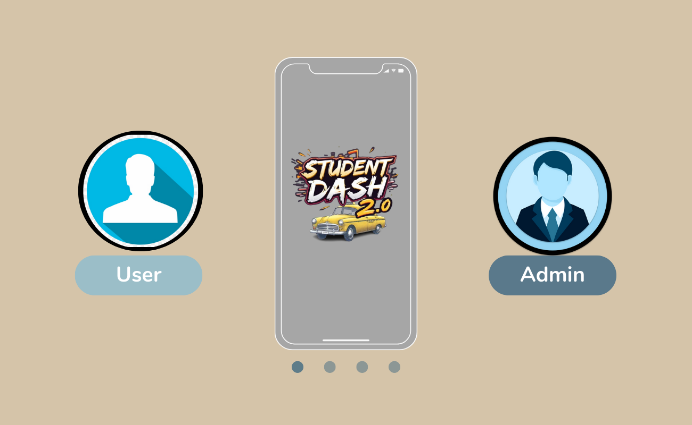
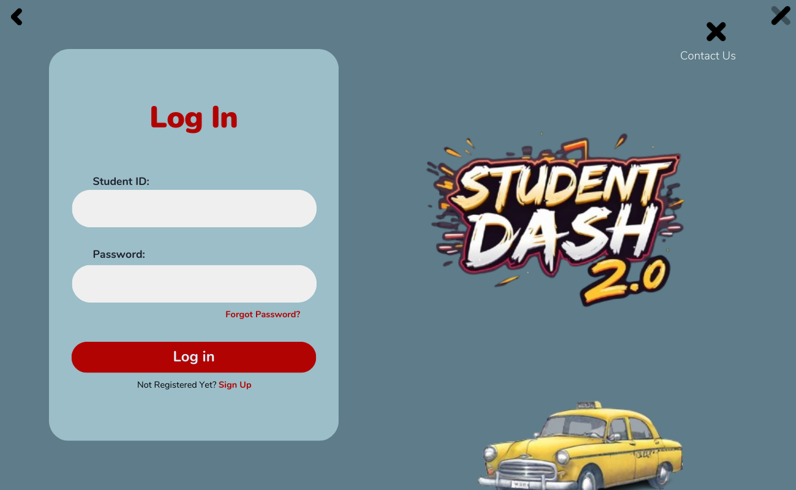
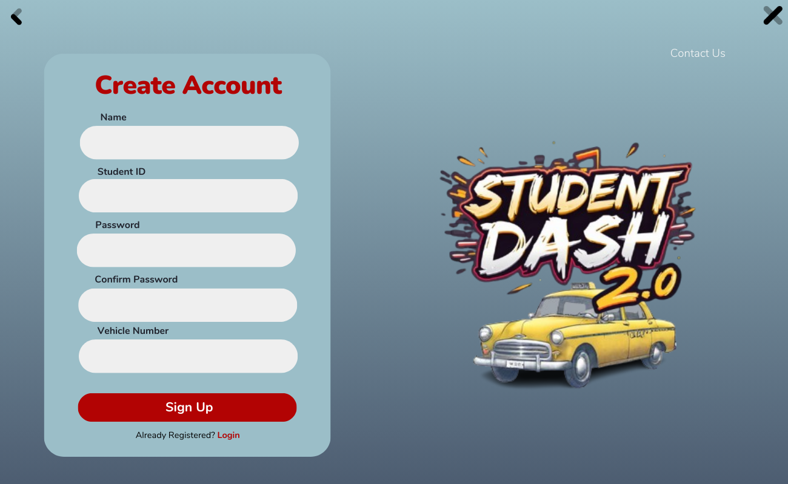
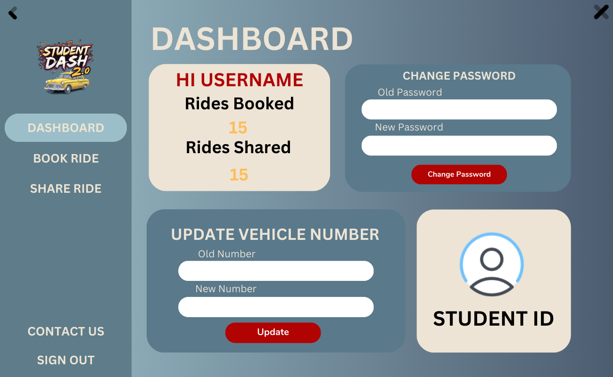
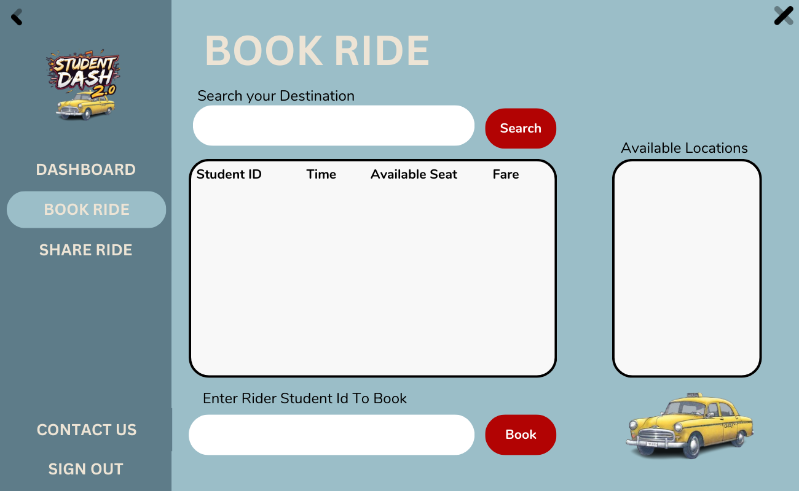
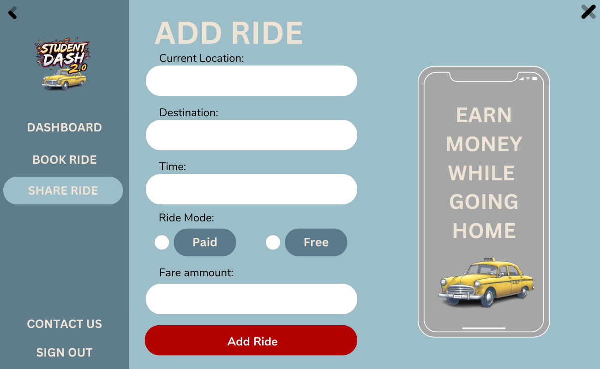
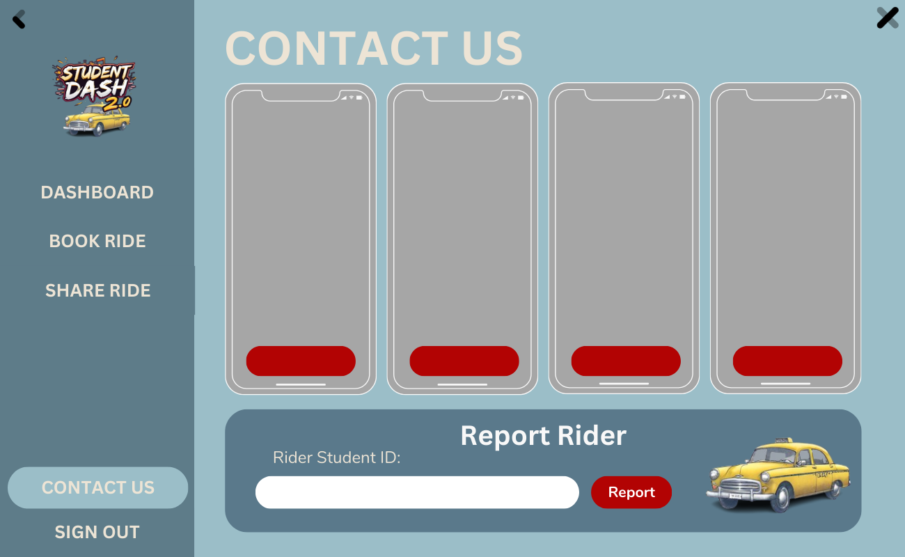
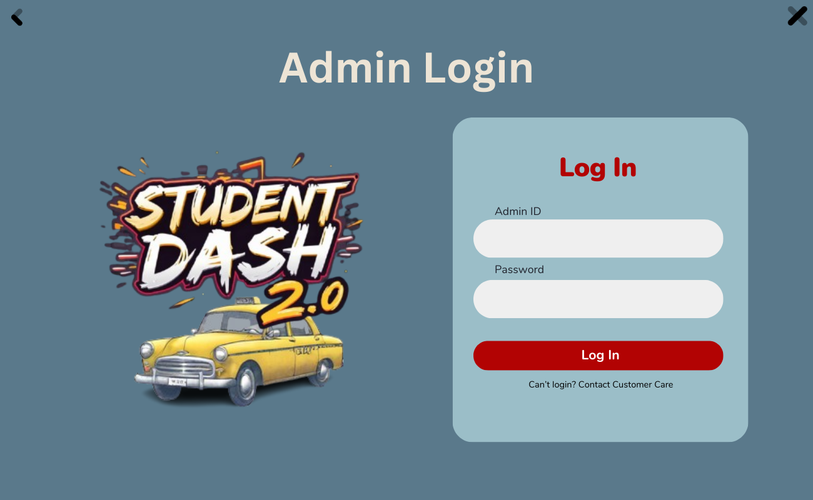
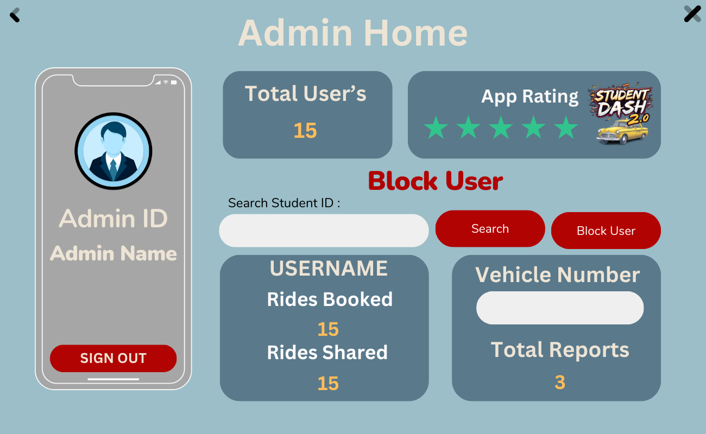

# StudentDash 2.0
### A C# Winforms application made with dotnet framework which solves a simple yet borthersome problem of the student community.

## Load Page

## User/Admin Checking Page

## User Login Page

## User Signup Page

## User Home Dashboard Page

## User Home Book Ride Page

## User Home Share Ride Page

## Contact Us Page

## Admin Login Page

## Admin Home Page

